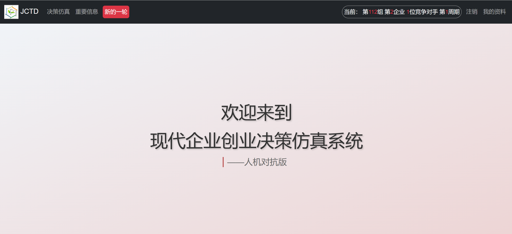
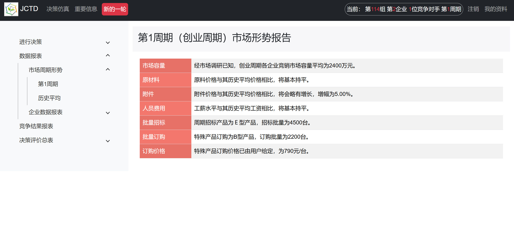
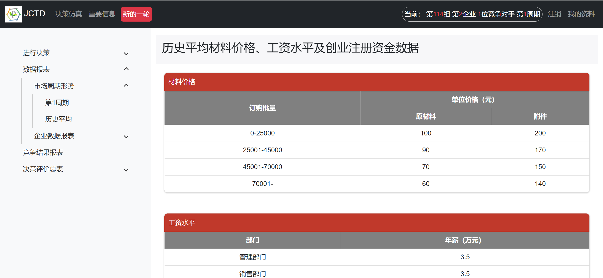
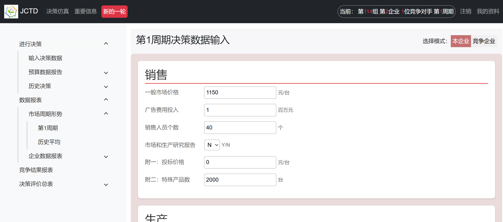
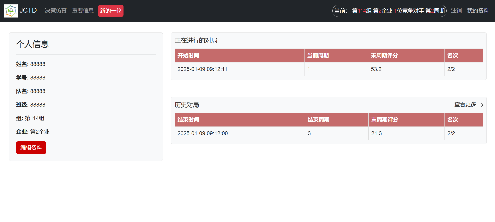

# 现代企业创业决策仿真系统
*本项目为“国家级管理决策虚拟仿真实验教学中心——决策天地”中，现代企业决策仿真系统部分的换新迭代网站*

技术栈：Django、Vue、Sqlite...

## 一、功能概述

以下对部分功能作简单概述

### 1.1 表格数据呈现

此部分相较于原网站主要进行了界面美化，表格显示方法等（只展示部分界面）

## 1.2 决策提交界面

此部分相较于原网站优化了“名词解释”功能的呈现方法；并根据更普遍合理的决策顺序，优化了决策界面呈现方式

## 1.3 个人资料界面

原网站无个人资料查看功能，现网站添加了个人资料界面，并记录且实时显示当前对局与历史对局信息

## 二、项目运行
### 2.1 依赖安装
安装依赖库

`pip install -r requirements.txt`

`npm install`

## 2.2 项目运行
后端服务运行

`python manage.py runserver`

前端服务运行

`npm run serve`

